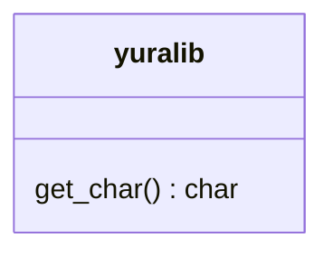
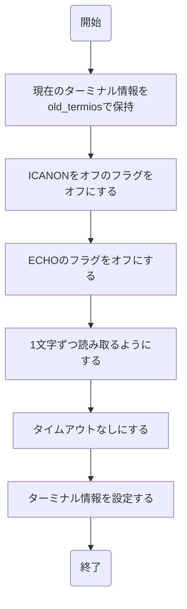

# クラス図

```mermaid
classDiagram
    class yuralib{
        get_char() char
    }
```
## コンストラクタ

```mermaid
flowchart TD
    A(開始)
    --> B[現在のターミナル情報をold_termiosで保持]
    --> C[ICANONをオフのフラグをオフにする]
    --> D[ECHOのフラグをオフにする]
    --> E[1文字ずつ読み取るようにする]
    --> F[タイムアウトなしにする]
    --> G[ターミナル情報を設定する]
    --> Z(終了)
```
