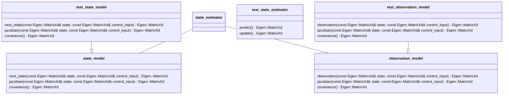
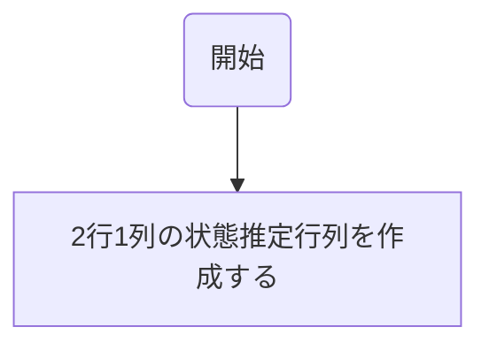

- [クラス図](#クラス図)
- [test日本語訳](#test日本語訳)
  - [sub](#sub)
  - [testああああ](#testああああ)

# クラス図

```mermaid
classDiagram
    class state_model{
        next_state(const Eigen::MatrixXd\&  state, const Eigen::MatrixXd\& control_input) Eigen::MatrixXd
        jacobian(const Eigen::MatrixXd\& state, const Eigen::MatrixXd\& control_input) Eigen::MatrixXd 
        covariance() Eigen::MatrixXd 
    }
    class observation_model{
        observation(const Eigen::MatrixXd\&  state, const Eigen::MatrixXd\& control_input) Eigen::MatrixXd
        jacobian(const Eigen::MatrixXd\& state, const Eigen::MatrixXd\& control_input) Eigen::MatrixXd 
        covariance() Eigen::MatrixXd 
    }


    class test_state_model{
        next_state(const Eigen::MatrixXd\&  state, const Eigen::MatrixXd\& control_input) Eigen::MatrixXd
        jacobian(const Eigen::MatrixXd\& state, const Eigen::MatrixXd\& control_input) Eigen::MatrixXd 
        covariance() Eigen::MatrixXd 
    }
    class test_observation_model{
        observation(const Eigen::MatrixXd\&  state, const Eigen::MatrixXd\& control_input) Eigen::MatrixXd
        jacobian(const Eigen::MatrixXd\& state, const Eigen::MatrixXd\& control_input) Eigen::MatrixXd 
        covariance() Eigen::MatrixXd 
    }


    class test_state_estimator {
        predict() Eigen::MatrixXd
        update() Eigen::MatrixXd
    }

    state_estimator -- observation_model
    state_estimator -- state_model
    test_observation_model --|> observation_model
    test_state_model --|> state_model


```

# test日本語訳

```mermaid
graph TD;
    A(開始)
    --> B[2行1列の状態推定行列を作成する]

```
## sub
## testああああ
